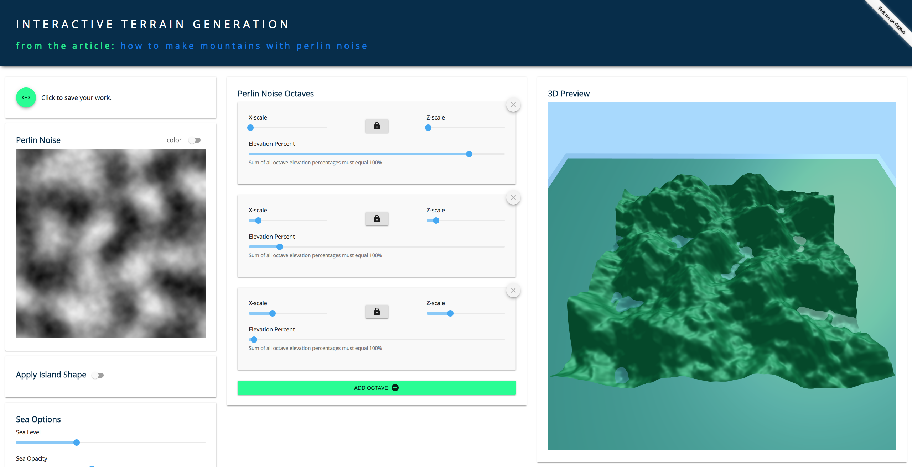

# Perlin Noise Terrain Interactive Demo

A responsive progressive Perlin noise playground for 3D terrain generation.

This application can be pulled down and run locally. You can also pull it down, tweak it, build it, and host the build contents on a static server.



## Dependencies

You will need NodeJS which ships with NPM. Once you have NodeJS and NPM run the following command within the `terrain-react-app` directory:
```bash
cd terrain-react-app
npm run start
```

That will install dependencies, start watches on files, and server the application locally ( typically localhost:3000 ).

To run a build which will generate the production `build` directory that can then be dropped into a static server, you will need to do two things:

1. Modify package.json and update the "hostname" property to point to the root of the host where the app will live.
2. Run the following command in your terminal:

```bash
cd terrain-react-app
npm run build
```

## Create React App

This app was bootstrapped using create-react-app. See the README.md file within terrain-react-app for more details.
